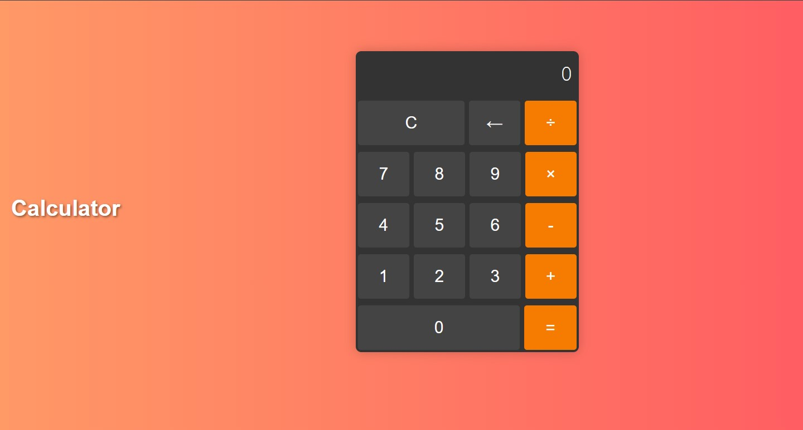

# Simple Calculator

This is a simple calculator web application built with HTML, CSS, and JavaScript. It allows users to perform basic arithmetic operations such as addition, subtraction, multiplication, and division.



## Features

- Addition (+)
- Subtraction (-)
- Multiplication (×)
- Division (÷)
- Clear (C)
- Backspace (←)
- Equals (=)

## Usage

1. Clone the repository:

   ```bash
   git clone https://github.com/chetankumarpulipati/calculator-js.git
